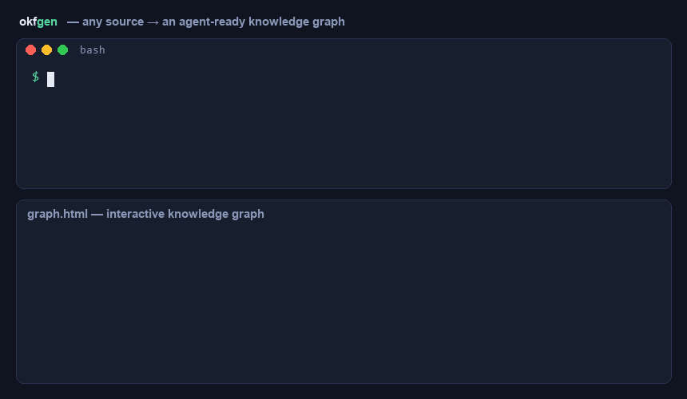
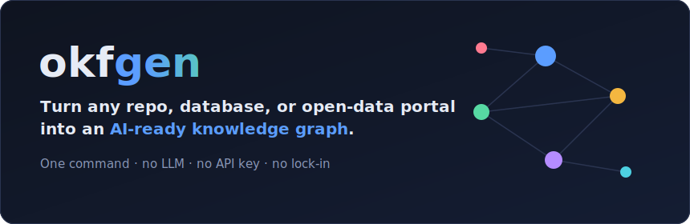

<!-- Once docs/demo.gif is recorded (see docs/RECORD_DEMO.md), swap the hero
     below to: <a href="https://bushans.github.io/okfgen/"></a> -->
<p align="center">
  <a href="https://bushans.github.io/okfgen/">
    
  </a>
</p>

<h1 align="center">okfgen</h1>

<p align="center">
  <strong>Point it at a repo, database, docs site, or open-data portal.<br>
  Get a portable, agent-ready knowledge graph in seconds — no LLM, no API key, no lock-in.</strong>
</p>

<p align="center">
  <a href="https://pypi.org/project/okfgen/"></a>
  <a href="https://github.com/bushans/okfgen/actions/workflows/ci.yml"></a>
  
  
  
  
  <a href="https://bushans.github.io/okfgen/"></a>
  <a href="https://github.com/bushans/okfgen/stargazers"></a>
</p>

<p align="center">
  <a href="https://bushans.github.io/okfgen/"><strong>▶ Explore the live interactive knowledge graphs →</strong></a>
</p>

---

`okfgen` is a deterministic reference implementation of **both sides** of the
[Open Knowledge Format (OKF)](https://github.com/GoogleCloudPlatform/knowledge-catalog/blob/main/okf/SPEC.md) —
Google's vendor-neutral standard for representing the knowledge around your data
and systems as **just markdown files with YAML frontmatter**
([announcement](https://cloud.google.com/blog/products/data-analytics/how-the-open-knowledge-format-can-improve-data-sharing/)).

- **Producers** turn a source system, database, docs site, or live open-data portal *into* a bundle.
- **Consumers** read a bundle back out — a viewer, a search index, a reasoning agent.

It extracts **structured facts straight from the source** (schemas, file
structure, READMEs, dependency manifests, page headings). No LLM and no API key
are required; an optional `--llm` flag adds Claude-powered enrichment where you
want it.

```
              PRODUCERS                              CONSUMERS
   git repo  ─┐                          ┌─  visualize  → interactive HTML graph
   database  ─┤                          ├─  search     → full-text index
  open data  ─┼─►  generate ─► BUNDLE ─► ┼─  ask        → reasoning agent
   local dir ─┤        │       (.md +    └─  validate   → conformance check
   web docs  ─┘        ▼      frontmatter)
                    enrich  (pass 2: join paths, backlinks, citations)
```

---

## Quickstart (30 seconds)

Zero-install with [`uv`](https://docs.astral.sh/uv/) — turn *this* directory into
a knowledge graph and open it:

```bash
uvx okfgen generate . -o my-okf
uvx okfgen visualize my-okf -o my-okf/graph.html
# then open my-okf/graph.html
```

Or with pip:

```bash
pip install okfgen
okfgen generate . -o my-okf && okfgen visualize my-okf -o my-okf/graph.html
```

> 🎥 **Demo GIF coming soon** (see [docs/RECORD_DEMO.md](docs/RECORD_DEMO.md)) —
> meanwhile the [live gallery](https://bushans.github.io/okfgen/) is fully interactive.

---

## Why okfgen

- **One command, any source → a knowledge graph.** Code, databases, docs, and
  live open-data portals — the same tool, the same output.
- **Deterministic, offline, no API key.** Reproducible facts, not LLM
  hallucinations. Runs in air-gapped environments. The LLM is strictly opt-in.
- **Open format, zero lock-in.** Output is plain markdown + YAML you can read,
  diff in git, and grep — not a proprietary database.
- **Agent-ready.** Search, a citation-backed reasoning agent, and a portable
  JSON index make bundles first-class context for RAG and AI agents.
- **A viewer you can email.** The visualizer is a single self-contained HTML
  file — no backend, no CDN, data never leaves the page.
- **Reference implementation of an open standard.** Tracks the OKF v0.1 spec;
  every bundle it emits passes its own conformance validator.

### How it compares

| | **okfgen** | Data catalogs<br>(DataHub / Amundsen) | LLM auto-doc tools | Hand-written wiki |
|---|:---:|:---:|:---:|:---:|
| Runs with no server/DB to deploy | ✅ | ❌ | ⚠️ | ✅ |
| No API key / no LLM required | ✅ | ✅ | ❌ | ✅ |
| Deterministic & reproducible | ✅ | ✅ | ❌ | ✅ |
| Open, plain-markdown output (no lock-in) | ✅ | ❌ | ⚠️ | ✅ |
| Code **and** DB **and** docs **and** live open data | ✅ | ⚠️ data only | ⚠️ | manual |
| Self-contained interactive graph viewer | ✅ | ⚠️ needs server | ❌ | ❌ |
| Agent-ready (search + reasoning over bundle) | ✅ | ⚠️ | ✅ | ❌ |
| Time to first result | **seconds** | hours–days | minutes | ∞ |

---

## Install

```bash
pip install okfgen                 # core: git, local, web, schema (zero deps)
pip install "okfgen[all]"          # + BigQuery, Firebase, MCP, PyYAML
```

Optional extras: `[bigquery]`, `[firebase]`, `[mcp]`, `[yaml]`, `[dev]`.
For development from a clone: `pip install -e '.[dev]'`.

---

## Producers — make a bundle from *your* data

```bash
okfgen generate https://github.com/psf/requests.git   # a source system (git)
okfgen generate ./my-project                          # a source system (local)
okfgen generate schema:./warehouse.schema.json        # a database (offline)
okfgen generate schema:./ddl.sql                      # a database (SQL DDL)
okfgen generate bq:my-gcp-project                     # BigQuery datasets/tables
okfgen generate firebase:my-firebase-project          # Firestore collections
okfgen generate https://docs.mytool.dev/              # a documentation site
okfgen generate ckan:https://portal/dataset/some-set  # a live CKAN open-data portal
okfgen generate socrata:https://data.cityofnewyork.us/d/erm2-nwe9  # a live Socrata dataset
```

| Input | Detected as | What it extracts |
|---|---|---|
| `git@…` / `*.git` / github URL | `git` | shallow-clones, then scans like a local dir |
| a directory path | `local` | README overview, per-directory code modules (functions/classes/types), doc files, dependency inventory |
| `schema:FILE.json` / `.sql` | `schema` | dataset + table concepts with full column schemas — **no cloud creds** |
| `bq:PROJECT` | `bigquery` | one concept per dataset and per table, with column schemas |
| `firebase:PROJECT` | `firebase` | one concept per Firestore collection, fields/types inferred from sampled docs |
| `ckan:PORTAL/dataset/SLUG` | `ckan` | a live [CKAN](https://ckan.org) open-data dataset → one concept per resource, with **live column schemas + example rows** from the DataStore. No auth; works against data.gov, data.gov.au, the EU portal, city portals, etc. |
| `socrata:DOMAIN/d/4x4-ID` | `socrata` | a live [Socrata](https://dev.socrata.com) dataset (NYC Open Data, Seattle, Chicago, many state portals) → Dataset + Table concepts with **live column schema + descriptions + example rows**. No auth. |
| `http(s)://…` | `web` | crawls same-host pages (depth/page budget) into one concept per page |

Cloud sources use Application Default Credentials
(`gcloud auth application-default login`). Output goes to `./<name>-okf/`.

### The enrichment agent (pass 2)

Producers *draft* concepts; the enrichment agent *enriches* them — exactly the
two-pass pattern from the OKF blog. Deterministically, it infers **join paths**
between tables from foreign-key naming (`customer_id → customers`) and wires
**backlinks** so the graph is navigable both ways:

```bash
okfgen enrich ./my-okf                 # in place
okfgen enrich ./my-okf -o ./enriched   # to a new directory
okfgen enrich ./my-okf --llm           # also rewrite descriptions via Claude
```

---

## Consumers — read a bundle back out

The OKF value proposition is producer/consumer independence: any consumer works
on any bundle, regardless of who produced it.

```bash
# Viewer: a self-contained interactive graph (no backend, no CDN, data stays local)
okfgen visualize ./my-okf -o graph.html

# Search index: full-text, TF-IDF ranked
okfgen search ./my-okf "weekly active users"
okfgen search ./my-okf --export index.json      # portable JSON index

# Reasoning agent: retrieves concepts, follows join links, answers with citations
okfgen ask ./my-okf "how do orders relate to customers?"
okfgen ask ./my-okf "..." --llm                 # phrase answer via Claude

# Conformance validation
okfgen validate ./my-okf --strict
```

`okfgen ask` shows its work — the retrieved concepts, the links it traversed, and
the citations behind the answer — so the reasoning is auditable.

---

## Use it inside your AI agent (MCP)

okfgen ships an **MCP server**, so Claude Desktop, Claude Code, Cursor, and any
[Model Context Protocol](https://modelcontextprotocol.io) client can produce and
reason over OKF bundles without leaving the agent.

```bash
pip install "okfgen[mcp]"
okfgen-mcp            # stdio MCP server
```

Register it (e.g. Claude Desktop `claude_desktop_config.json`, or Cursor's MCP
settings):

```json
{
  "mcpServers": {
    "okfgen": { "command": "okfgen-mcp" }
  }
}
```

Exposed tools: `okfgen_generate`, `okfgen_search`, `okfgen_ask`,
`okfgen_validate`, `okfgen_visualize`, `okfgen_list_source_types`. Now an agent
can say *"catalog this database and tell me how orders join to customers"* and
get grounded, cited answers.

---

## Sample bundles

**Browse the sample knowledge graphs online:** https://bushans.github.io/okfgen/

Ready-to-browse bundles live in [`samples/bundles/`](samples/bundles). Open any
`graph.html` in a browser, or point the consumers at them. The same visualizers
are published to GitHub Pages from [`docs/`](docs) (regenerate with
`python samples/build_pages.py`).

- Three **offline, reproducible** bundles (database, source system, docs site):
  `python samples/build_samples.py`
- One **live public-data** bundle — *Toronto Beaches Water Quality* from the
  Toronto Open Data CKAN portal: `python samples/build_live_samples.py`

See [samples/README.md](samples/README.md) for details.

---

## Output layout

```
<name>-okf/
├── index.md            # root listing + okf_version: "0.1"
├── log.md              # generation / enrichment log (ISO-dated)
├── overview.md         # the root "Project" / "Data Project" concept
├── dependencies.md     # parsed manifests (git/local)
├── docs/…              # documentation concepts
├── modules/…           # per-directory code concepts (git/local)
├── datasets/… tables/… # database / BigQuery concepts
├── collections/…       # Firestore concepts
├── pages/…             # web page concepts
└── graph.html          # (after `visualize`) the interactive viewer
```

Every concept carries the required `type` frontmatter field plus recommended
`title`/`description`/`resource`/`tags`/`timestamp`, and bodies use the
conventional OKF `# Schema`, `# Examples`, `# Citations`, `# Joins` headings.

---

## Design notes

- **Deterministic by default.** git/local/web/schema run on the **standard
  library alone** (zero third-party deps). Cloud SDKs and the LLM are optional
  extras, loaded lazily and off unless you ask.
- **Producer/consumer split.** Consumers depend only on markdown + frontmatter
  (`okfgen/consumer.py`), never on producer internals.
- **Scriptable.** Every command prints its primary output path to **stdout** and
  logs to **stderr**: `BUNDLE=$(okfgen generate ./repo)`.

## Development

```bash
pip install -e '.[dev]'
pytest
```

New to the project? [**TESTING.md**](TESTING.md) is a step-by-step VS Code
walkthrough: environment setup, running the test suite, and driving every
producer/consumer command locally.

## License

Apache-2.0.
